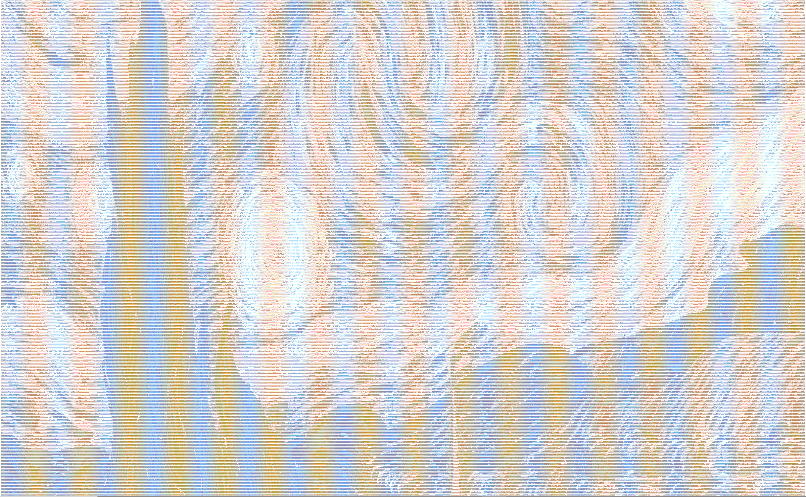

<h1>Image to ASCII Generator</h1> 

 This program takes a picture as a command line argument and outputs the picture in the form of ASCII characters. Here is an example of this done with the famous painting, The Starry Night by Vincent Van Gogh: 

 And here is the resulting ASCII image: 

 My program turns the original image into greyscale and then turns each pixel into an ASCII character (@, #, S, %, ?, *, +, ;, :, ,, .) depending on its brightness. 

